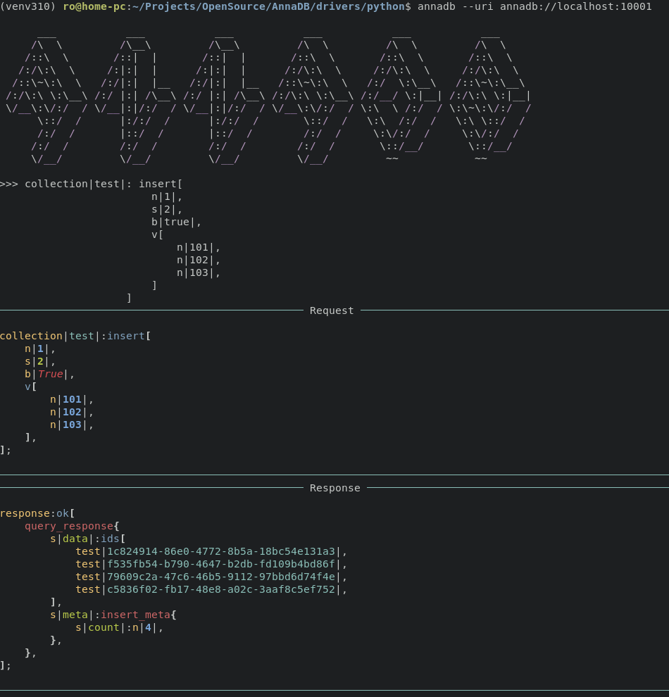
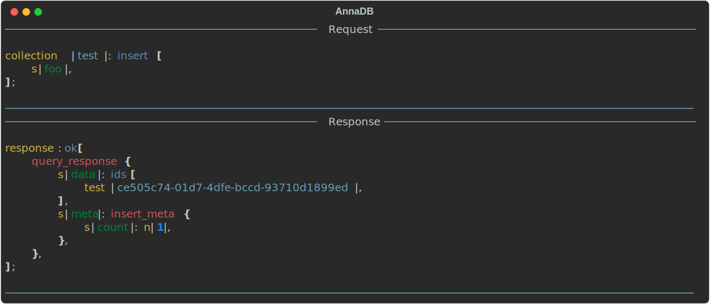
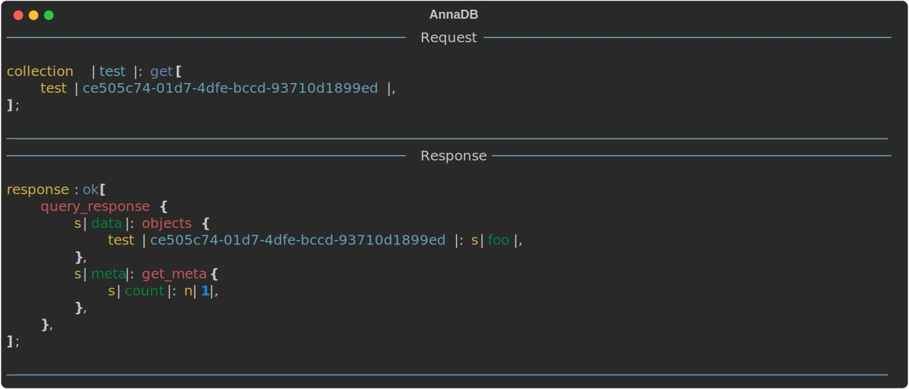
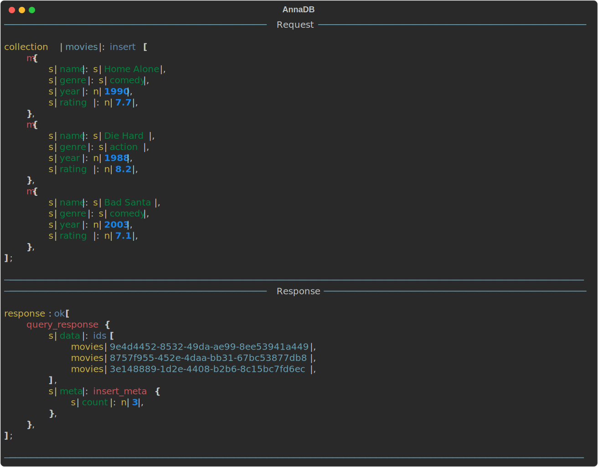
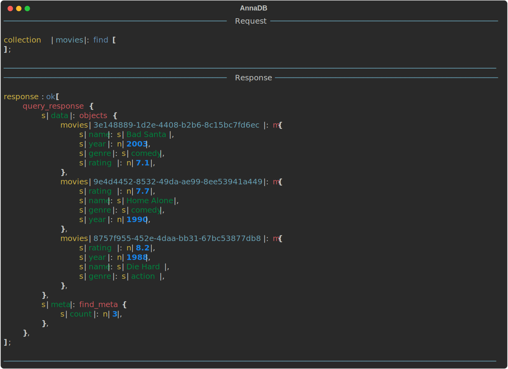
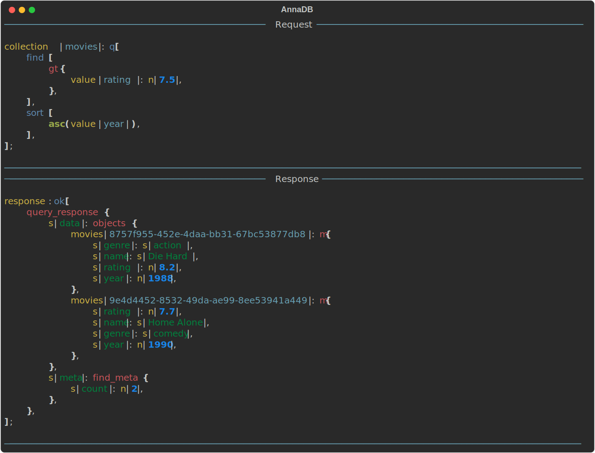
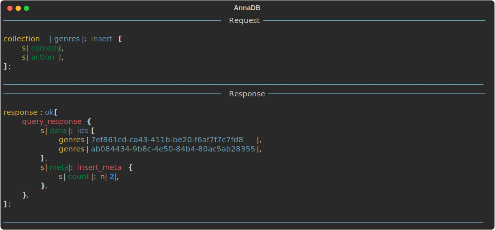
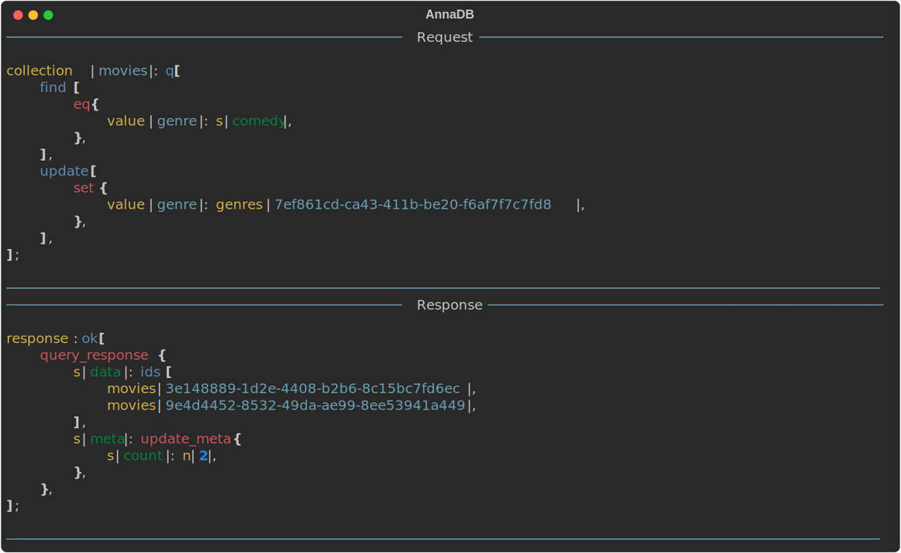
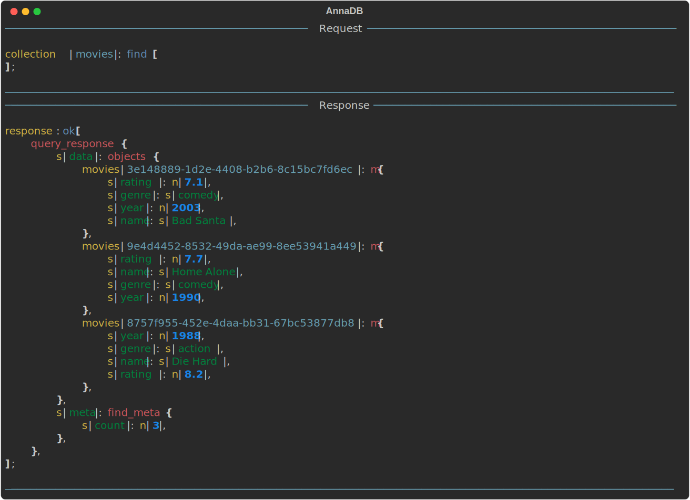
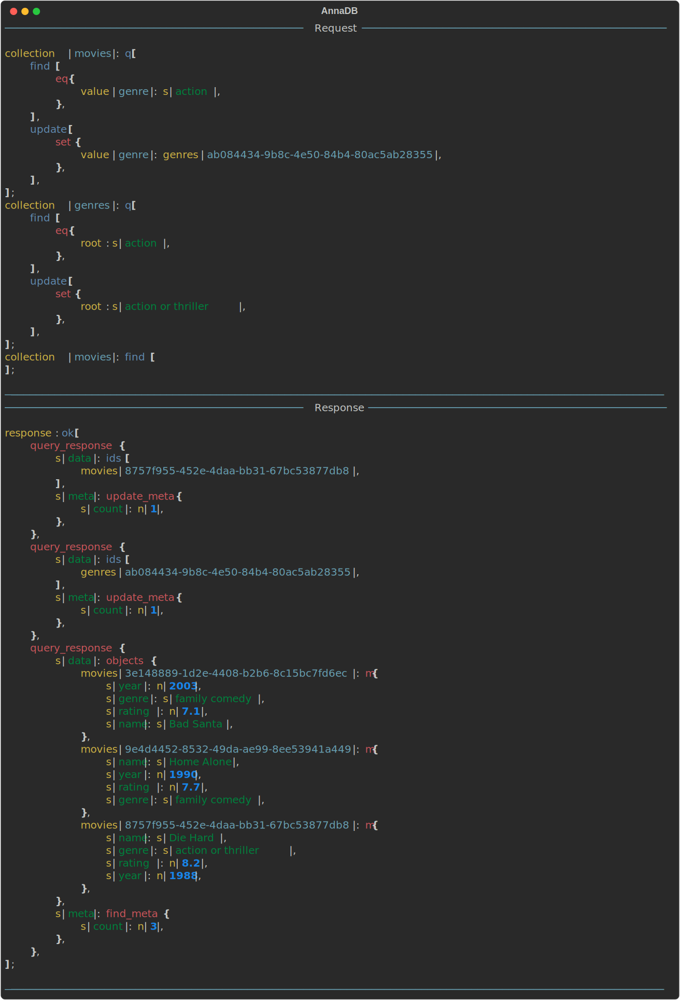

## Intro

AnnaDB - is a next-generation developer-first database. The main idea of it is to move the experience, that developers got working with programming languages to the DataBase field. Every value stored in AnnaDB is an object with a unique link. If an object has a link to another object as a field value, AnnaDB will fetch it inside automatically for any operation (find, update, any).

The key features are:
- Storing single primitives as with key-value databases
- Storing objects as with document databases 
- Every value is an object with its unique link
- Relations between objects are fetched automatically inside the DB for any query (find, update, etc.)
- Transactions

As a query language format AnnaDB uses [TySON](https://github.com/roman-right/tyson). The query language documentation could be found [here]().

### Installation

Docker:

```shell
docker command
```

Client shell:

```shell
pip install pyannadb

annadb --uri annadb://localhost:10001
```

Shell screenshot:



### Primitives

AnnaDB supports the next primitive types for now:
- Numbers - `s|foo|`
- Strings - `n|100|`
- Boolean - `b|true|`
- Unix timestamps - `uts|123456789|`
- Link - `collection_name|4cf2fb76-f57a-4b6c-b0de-6ad7efa3fc3a|`
- Null - `null`

Let's start with inserting. It could be done using `insert[...]` query.



Let's get it by id:



### Containers
AnnaDB supports next types of containers:

- Vector - `v[1, 2, 3, s|foo|, b|true|]`
- Map - `m{s|foo|:n|100|, s|bar|:n|200|}`

Let's make a Christmas movies database for example.

Firstly I'll insert the information about the movies `Home Alone`, `Die Hard` and `Bad Santa` using the insert query:



As you can see, it is allowed to insert more than one object.

We can find objects using `find[...]` query. Let's find all the movies now



We also can search them by any field value. Let's find all the movies with ratings greater than 7 and sort them by year:



As you can see in this example, a query set (pipeline of queries) could be used when a single query is not enough. The set of queries is wrapped by `q[...]` in this case.

It looks like `genre` field values could be moved to a separate collection. Let's insert them into the collections `genres`



Now I'll update the `comedy` genre of the already existing movies using the link of the inserted object.



Let's look at how AnnaDB will fetch the links on finding



As you can see, the link to the primitive object was fetched during `find[...]` to the value. No special operations were needed for this.
Let's update the original primitive now. And see, how it will be fetched again


Now find all again:


Another interesting feature of AnnaDB is transactions. It is possible to do operations over different collections in a single call to the database. Let's update the `action` genre in the `genres` collection and set it as a value of the respective field in the `movies` collection:



The transaction is a list of query sets. The response consists of all the query sets responses. If something goes wrong during transaction, it will roll back all the transaction steps.
